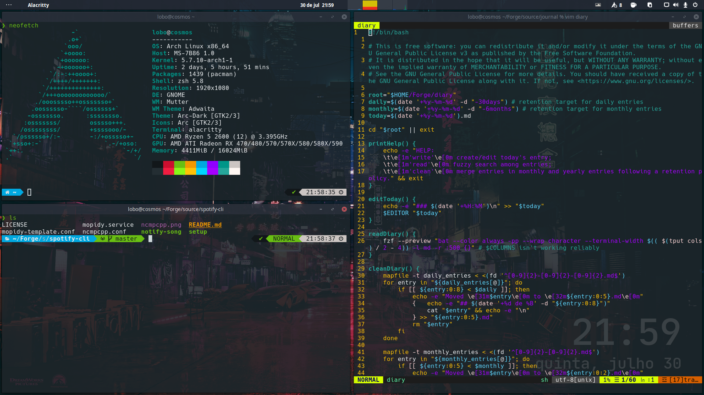

<!-- TOC GitLab -->

* [What is this?](#what-is-this)
* [How it works?](#how-it-works)
* [Where is everything?](#where-is-everything)
* [Gems](#gems)
    * [Fuzzy search](#fuzzy-search)
    * [Nebula](#nebula)
* [Todo](#todo)

<!-- /TOC -->

# What is this?
These are some of my Linux configuration files. Interpreters, terminals, text editors, plugins, utils, etc.


# How it works?
I created a bare git repo as instructed by [harfangk](https://harfangk.github.io/2016/09/18/manage-dotfiles-with-a-git-bare-repository.html).


# Where is everything?
- **assets**: screenshots and terminal svg animations
- **dotfiles**: my dotfiles
- **gnome**: hacks for gnome desktop
- **themes**: themes and ricing material

```shell
git init --bare $HOME/.dotfiles`
echo 'alias git-dotfiles="/usr/bin/git --git-dir=$HOME/.dotfiles/ \
    --work-tree=$HOME"' >> $HOME/.aliases
git dotfiles config --local status.showUntrackedFiles no
```
# Gems
## Fuzzy search
**fzf-special** is a shell function that does specialized fuzzy searchs with [fzf](https://github.com/junegunn/fzf).

- **hidden**: hidden files
- **markdown**: markdown files
- **pdf**: pdf, ps and eps files
- **media**: videos and audio files
- **cd**: browse directories and cd
- **ps**: search and manage processes

**cd**

[](https://asciinema.org/a/349907)

**ps**

[](https://asciinema.org/a/349904)

## Nebula
Nebula is a colorful color scheme that fits well with space, futurism and cyberpunk thematics. It started as terminal colors and growed to a set of themes for the applications I use.



# Todo
TODO: Merge linux-desktop-hacks here. +asap
